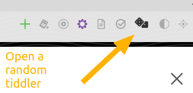

# TW5RandomTiddlerButton
Adds a random tiddler button to TiddlyWiki's page toolbar. To install simply import [RandomTiddlerButton.tid](https://github.com/SonephetR2/TW5RandomTiddlerButton/blob/main/%24__plugins_kiasu_RandomTiddlerButton.tid) to your TiddlyWiki, or navigate to the [demo TiddlyWiki](http://sonephetr2.github.io/) and drag and drop the plugin to your own Tiddlywiki.

Requires [Tobibeer's random plugin](https://tobibeer.github.io/tw5-plugins/#random).

----

Log:

* 210808: First official release.
